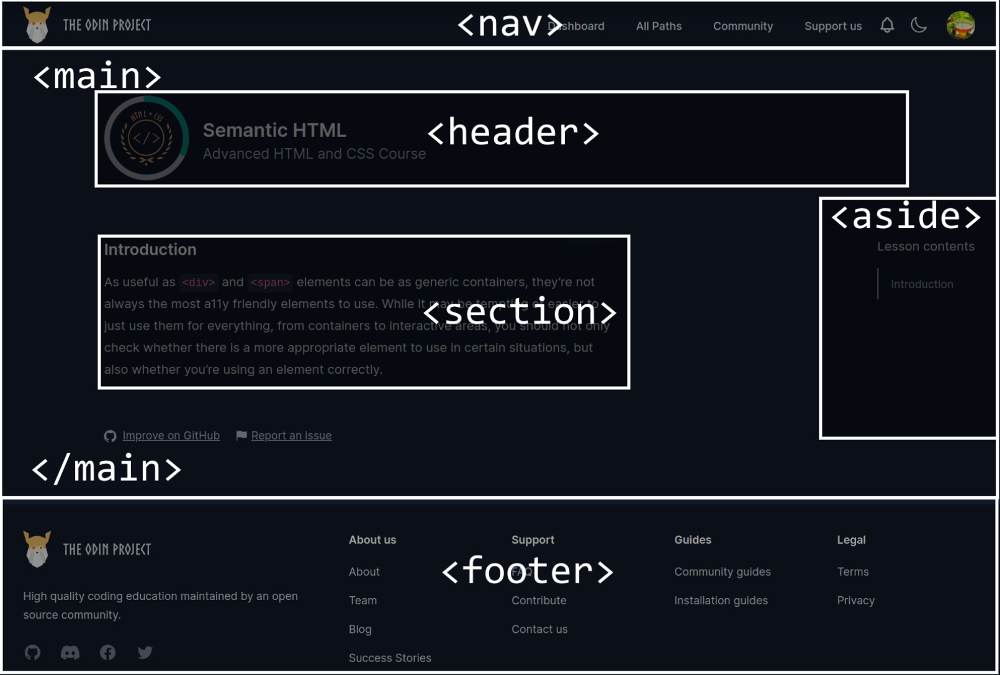

# web-dev-notes: A list of things to consider when building a website

## HTML Semantic




## Accessibility

### Auditing

- [Lighthouse](https://developer.chrome.com/docs/lighthouse/overview)

### Color Contrast

- [Check the color contrast for text and background](https://coolors.co/contrast-checker/112a46-acc8e5)

## Responsiveness

### Avoid fixed width and height

Instead use a dynamic + fixed system:

```css
div {
	width: 80%;
	max-width: 750px;
}
```

- dynamic
  - Use % for widths (parents and children).
  - Mostly avoid heights
- fixed
  - `max-width` (or `min-width`).
  - `min-height` (or `max-height`).

### Units

- Use `rem` for text, margins, and padding.
- Use `em` for button padding so it scales relative to the button’s font size.

### Flex

- `flex-wrap`

### Grid

- `minmax`
- `auto-fill`
