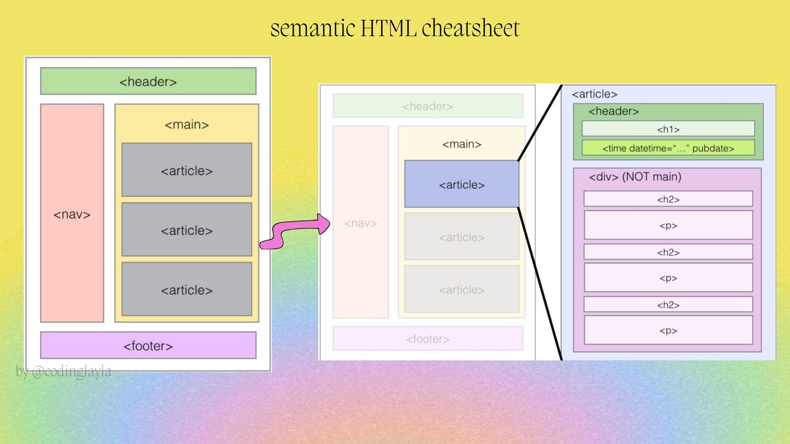

# web-dev-notes: A list of things to consider when building a website

## HTML Semantic




## Accessibility

### Auditing

- [Lighthouse](https://developer.chrome.com/docs/lighthouse/overview)

### Color Contrast

- [Check the color contrast for text and background](https://coolors.co/contrast-checker/112a46-acc8e5)

## Responsiveness

### Avoid fixed width and height

Instead use a dynamic + fixed system:

```css
.container {
	width: 80%;
	max-width: 750px;
	margin: 0 auto;
}
```

- dynamic
  - Use % for widths (parents and children).
  - Mostly avoid heights
- fixed
  - `max-width` (or `min-width`).
  - `min-height` (or `max-height`).

### Units

- Use `rem` for text, margins, and padding.
- Use `em` for button padding so it scales relative to the button’s font size.

### Flex

- `flex-wrap`

### Grid

#### Construction of the grid

```css
.grid-parent {
	grid-template-columns: 1fr 2fr;
	grid-template-rows: 100px 1fr;
}
/* Prefer fr, auto, or minmax over % for grid tracks */

.sidebar-child {
	grid-column: 1;
	grid-row: 1 / 3;
}
```

When there is a **fixed number** of rows and columns, areas give semantic meaning to the grid:

```css
.grid-parent {
	grid-template-areas:
		'sidebar header'
		'sidebar main'
		'sidebar footer';
}

.sidebar-child {
	grid-area: sidebar;
}
.header-child {
	grid-area: header;
}
.main-child {
	grid-area: main;
}
.footer-child {
	grid-area: footer;
}
```

#### Responsive grid

- `auto-fill`
- `minmax`

```css
.grid-parent {
	grid-template-columns: repeat(auto-fill, minmax(200px, 1fr));
}
```

#### Grid alignment

- Horizontal or vertical alignment?

  - Columns move horizontally: `justify-content`, `justify-items` & `justify-self`
  - Rows move vertically: `align-content`, `align-items` & `align-self`

Resource: [Interactive guide by Josh Comeau](https://www.joshwcomeau.com/css/interactive-guide-to-grid/#aligning-rows-10)
